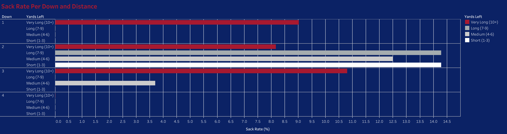

# New York Giants Pass Protection Analysis (2025 Season)

Key Question: Is the New York Giants Offensive Line providing sufficient protection for rookie quarterback Jaxson Dart and for the offense in general? The Giants are ranked 19th in the NFL in average passing yards per game (as of November 4, 2025). How much responsibility does the offensive line have for this subpar passing performance?

# Tools Used and Methods
To complete this project, I utilized a Python script (seen in this repository) and made use of the nflreadpy Python libary. From this library I obtained play-by-play data from all the games in the 2025 NFL season. I also used the Pandas and matplotlib libaries to filter the data to only the NY Giants offensive plays, and then further to only their pass plays of the season. After searching through the data I discovered there were some anomalies with two-point conversion plays and thus filtered them out.

I then grouped the plays by down and by remaining distance (e.g. 1st and 10) and found the sack rate on each category to find situational weaknesses. I imported this aggregated data into Tableau and produced the visualization below.

### Final Analysis: Sack Rate by Down & Distance

To explore the data (including sample sizes and total sacks), please see the interactive dashboard published on Tableau Public: [Tableau Public](https://public.tableau.com/views/NYGSackRate/Sheet1?:language=en-US&publish=yes&:sid=&:redirect=auth&:display_count=n&:origin=viz_share_link)

# Results Analysis
This chart illustrates the Giants' sack rate in different scenarios. The horizontal bars represent the sack rate and the tooltips (seen when hovering over the bars at the link above) provide the sample size, or number of dropbacks total.

Key findings from this graph include the Giants' crucial vulnerability on second downs. This is the down on which they have their worst performance, boasting a 14.29% sack rate on 2nd and short (N=7), a 12.5% sack rate on 2nd and medium (N=16), a 14.29% sack rate on 2nd and long (N=28), and a 8.16% on 2nd and very long (N=49). Out of the total 100 dropbacks on second down throughout the season, the Giants have allowed 11 sacks. This is a very troubling statistic that is aligned with their current ranking of 7th in the NFL in most amount of sacks allowed (as of November 4, 2025).
Another takeaway is that the Giants are also failing on obvious passing scenarios. For example, in 3rd and very long (10+ yards) situations the Giants have a sack rate of 10.81% (N=37). This suggests an offensive line that struggles with pass blocking against defenses that expect a pass, perhaps due to better coverage on receivers which causes the quarterback to hold the ball longer. However, that is an area of investigation for future studies.

# Limitations and Next Steps
This research used the sack rate as its sole measure. Sack rate is inherently "noisy," as sacks can be the fault of the quarterback and not the offensive line as well. This can be due to wayward scramble attempts or holding the ball too long. The next iteration of this project would be to focus on pressure rate instead. This is a more clear-cut metric that indicates a failure of the offensive line and attempts to separate QB-responsible sacks and OL-responsible sacks.
